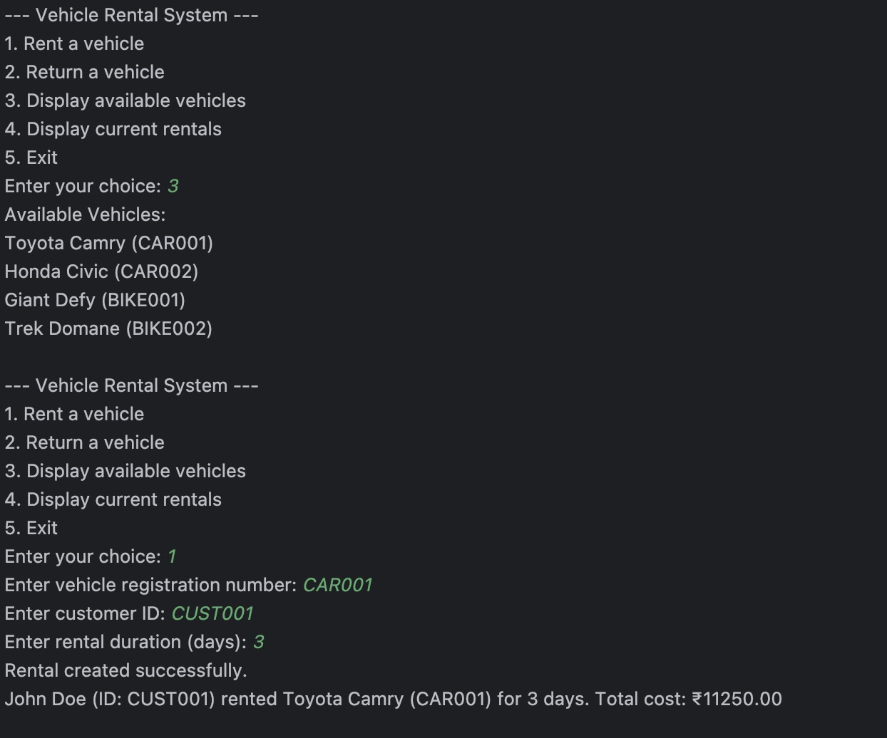

# Vehicle Rental System


## Project Description
The Vehicle Rental System is a Java-based application that simulates the management of a vehicle rental service. It allows users to rent different types of vehicles, manage inventory, and handle customer transactions. This system provides a command-line interface for easy interaction and management of rental operations.

## Table of Contents
- [Prerequisites](#prerequisites)
- [Installation](#installation)
- [Usage](#usage)
- [Features](#features)
- [Screenshots/Media](#screenshotsmedia)
- [Future Improvements](#future-improvements)
- [Contributing](#contributing)
- [License](#license)
- [Credits](#credits)
- [Author](#author)
- [Conclusion](#conclusion)
- [Connect with Me](#connect-with-me)

## Prerequisites
To run this project, you need to have the following installed on your system:
- Java Development Kit (JDK) 8 or higher
- An Integrated Development Environment (IDE) like IntelliJ IDEA or Eclipse (optional)

## Installation
1. Clone the repository:
   ```sh
   git clone https://github.com/AnirudhAravalli/Vehicle-Rental-System.git

2. Navigate to the project directory:
   ```sh
   cd Vehicle-Rental-System
3. Compile the Java files:
   ```sh
   javac *.java

## Usage
Run the main class VehicleRentalSystem:
      
   java VehicleRentalSystem


Follow the on-screen prompts to interact with the system. The main menu offers the following options:
1. Rent a vehicle
2. Return a vehicle
3. Display available vehicles
4. Display current rentals
5. Exit

## Features
- Multiple vehicle types (Cars and Bikes)
- Inventory management
- Customer rental transactions
- Rental duration tracking
- Display of available vehicles and current rentals
- Simple and intuitive command-line interface

## Screenshots/Media

*Main interface of the Vehicle Rental System showing user interactions.*

## Future Improvements
- Implement a graphical user interface (GUI)
- Add a database for persistent storage
- Implement user authentication and authorization
- Add more vehicle types and rental options
- Implement a pricing system based on vehicle type and rental duration

## Contributing
Contributions are welcome! Please feel free to submit a Pull Request.

## License
This project is licensed under the MIT License - see the [LICENSE](LICENSE) file for details.

## Credits

- **f(Y)_Solutions**: For providing the training module.
- **Contributors**: 
  - [Anirudh Aravalli]((https://github.com/AnirudhAravalli))

## Author

Anirudh Aravalli - [anirudh.aravalli05@gmail.com](mailto:anirudh.aravalli05@gmail.com)

## Conclusion

Thank you for checking out the Digital Wallet Management System. Feel free to contribute and provide feedback!

## Connect with Me

- [LinkedIn](https://www.linkedin.com/in/anirudh-a-25b28a257/)
- [GitHub](https://github.com/AnirudhAravalli)
